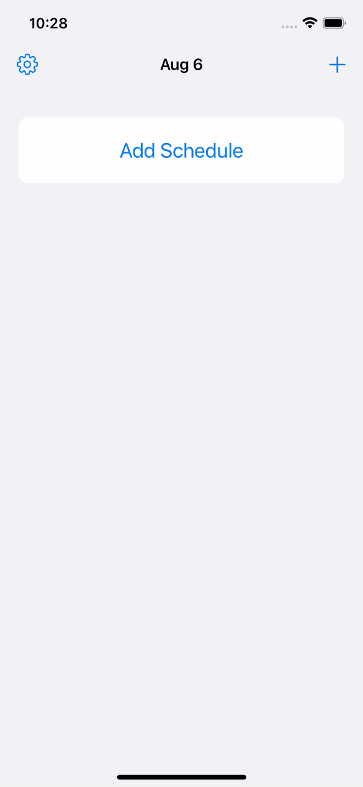

# Oteire

`Oteire` is a reminder app for iOS.

## Description

There are so many reminder apps in App Store. However, I didn't like them. I wanted a very simple reminder app so I make it.

## Demo

## VS.

[Reminders](https://apps.apple.com/jp/app/reminders/id1108187841)
Made by Apple.
Has more features.

## Usage

First, make a schedule.
`Oteire` notifies you when the scheduled date time.
After finishing a task, tap `Mark as Done`.
The date time will be updated to the next.

When `Retain Notifications` is on, notifications of expired schedules stay on Notification Center.
Not to be notified repeatedly, tap `Mark as Done`.

## Install

## Contribution

1. Fork it ( https://github.com/HotariTobu/Oteire )
2. Create your feature branch (git checkout -b my-new-feature)
3. Commit your changes (git commit -am 'Add some feature')
4. Push to the branch (git push origin my-new-feature)
5. Create a new Pull Request

## License

[Unlicense](LICENSE)

## Author

[HotariTobu](https://github.com/HotariTobu)
